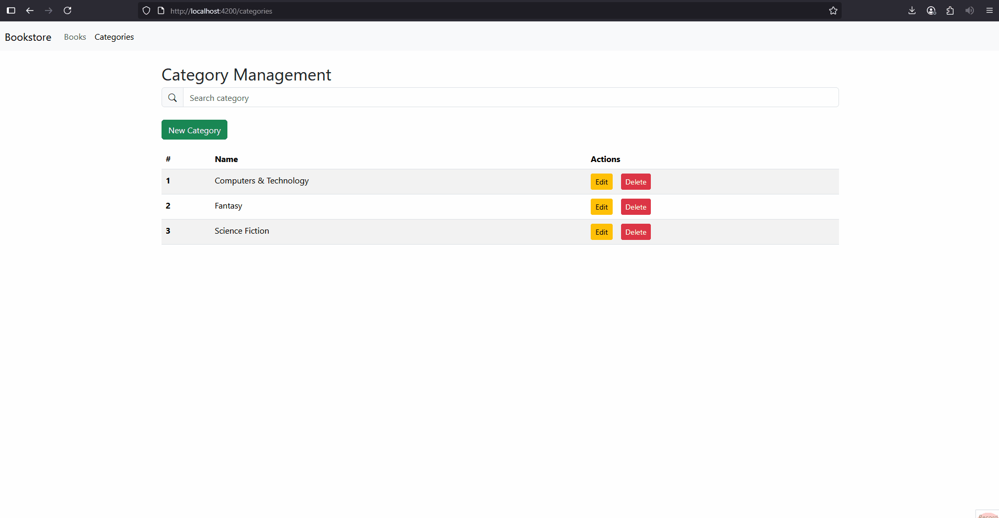
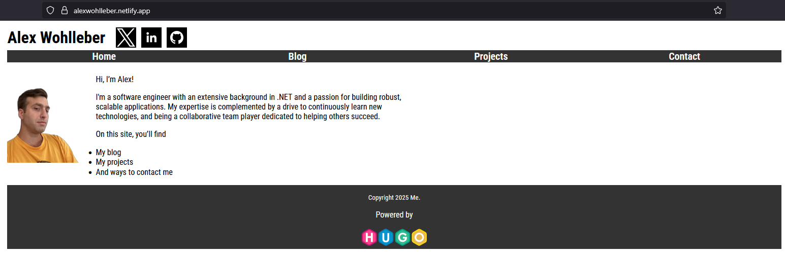

<h1 align="center">Hi 👋, I'm Alex Wohlleber</h1>
<h3 align="center">A passionate software engineer with expertise in the .NET sphere. From using various front-end frameworks and development processes to building reliable back-end services.</h3>

<h3 align="left">Connect with me:</h3>

<h3 align="left">Languages and Tools:</h3>

                         

<h3 align="left">Projects:</h3>

<table bordercolor="#66b2b2">  
  <tr>
    <td width="50%" valign="top">
      <h3 align="center">Bookstore</h3>
         
        
         
        
          
          <a href="https://github.com/alwoh/Bookstore" target="_blank">
            Github Repo
          </a>   
        

        
<strong>.NET Core, Angular, Bootstrap, Entity Framework, & SQL Server</strong> - Bookstore demostrating RESTful principles, and SPA front-end using it's methods

    </td>
    <td width="50%" valign="top">
      <h3 align="center">My Website</h3>
         
        
         
        
          
          <a href="https://github.com/alwoh/portfolio-hugosite" target="_blank">
            Github Repo
          </a>   
        

        
<strong>HTML, CSS, Javscript, & HUGO</strong> - My portfolio website

    </td>
  </tr>
</table>

